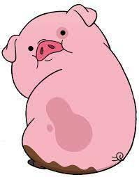

<html>
<head>
<body background="https://th.bing.com/th/id/OIP.eHq3x7HcUgitlALHD2HalAHaHa?w=155&h=180&c=7&r=0&o=5&pid=1.7">
<title>Validar si la contraseña y la repetición de la contraseña son iguales</title>
<link rel="stylesheet" href="estilo.css">

</head>

<h1>Bienvenido a tu contraseña</h1>

para poder ingresar necesitas colocar tu contraseña correctamente.

<form action="" name="f1">
Contraseña:<input type="password" name="clave1" size="20">
 
Repite contraseña:<input type="password" name="clave2" size="20">
 
<input type="button" value="Comprobar si son iguales" onClick="comprobarClave()">

</form>
</body>
</html>
